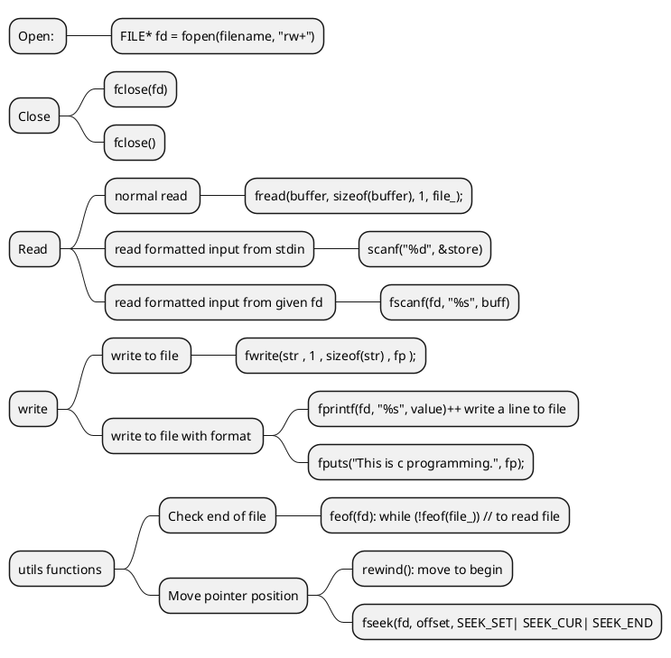

<p style="text-align:center;">

</p>

- [File IO](#file-io)
- [Common functions](#common-functions)
  - [Code Syntax](#code-syntax)
- [Example Exercise](#example-exercise)


# File IO 

# Common functions 
- read: fread(), fscanf() or scanf(), fgets(),
- write: fwrite(), fprinf(), fputs(), 



## Code Syntax 

```c
//Open : 
FILE * fd =  fopen(filename, "r+"); 

//Close:
fclose(fd); 

/* =============================================================== */

/* Read and Write file based on format: fscanf(), scanf() vs  fprintf() */

/* Read from file*/
int number = fscanf(fd, "%s %d", &val_str, &val_int);
// example: read whole file:
char buff[80] = {0};

while(fscanf(fd, "%s", buff) != EOF)
{
    printf("%s", buff);
}

/* Read from user input */
scanf("%d", &val_int);


/* Write to file*/ 
int number = fprintf(fd, "Data is wrote to file %d - %s", val_int, &val_str);

/* =============================================================== */
/* Read and write a line: fgets() vs fputs() */

/*  Read: fgets(buff, size , fd) */

char buff[80] = {0};
int number = fgets(buff, 80, )

/* Write: fputs(buff, fd) */

const char* str = "Hello world";
fputs(str, fd);


/* =============================================================== */
/*  Read and write a character: fgetc() vs fputc() */
// Read 1 character: 

char c = fgetc(fd) ; // != EOF
// Read from user input 
char c = getch();


// Write a character to file:
fput('C', fd);  


// Move pointer to begin : rewind()

// Return current position : ftell()

// Move pointer to a specific position: fseek()

```

# Example Exercise 


1. Get from input and write to file 

```c
#include <string.h>
...
while((fgets(sentence, sizeof(sentence), stdin) != NULL) && 
    (strcmp(sentence, "exit\n") != 0)) {
  fputs(sentence,fp);
}
fclose(fp);  // Code is missing this

```


```


